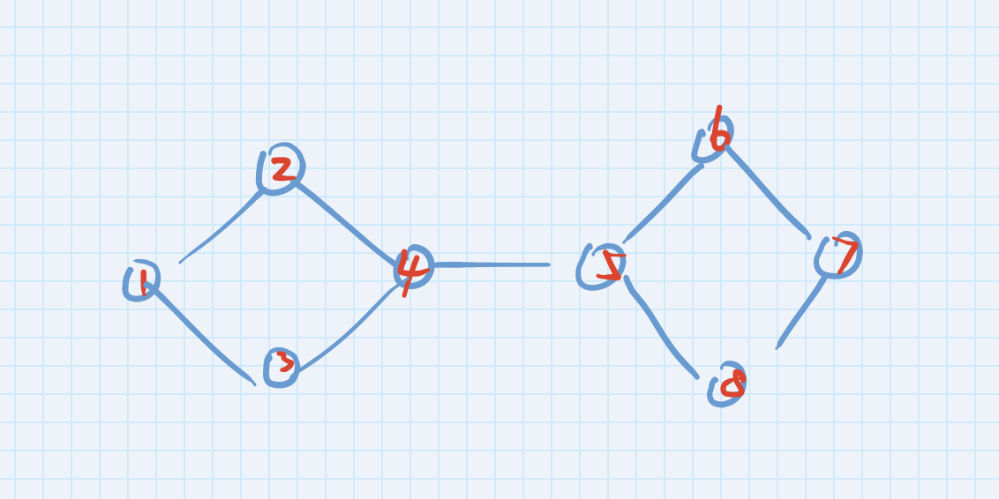
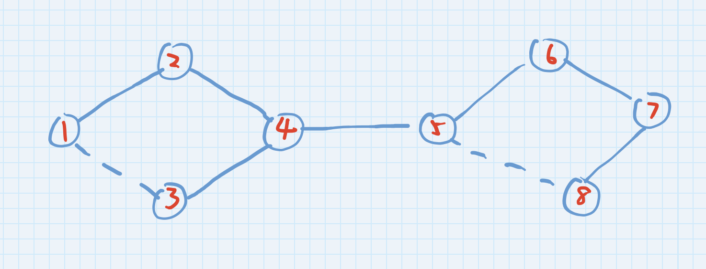
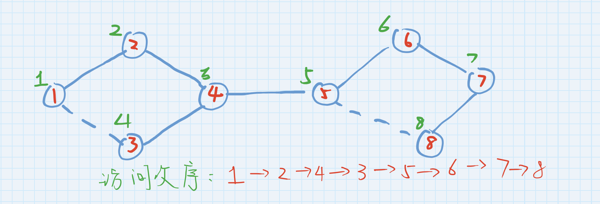
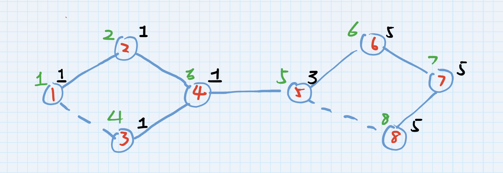
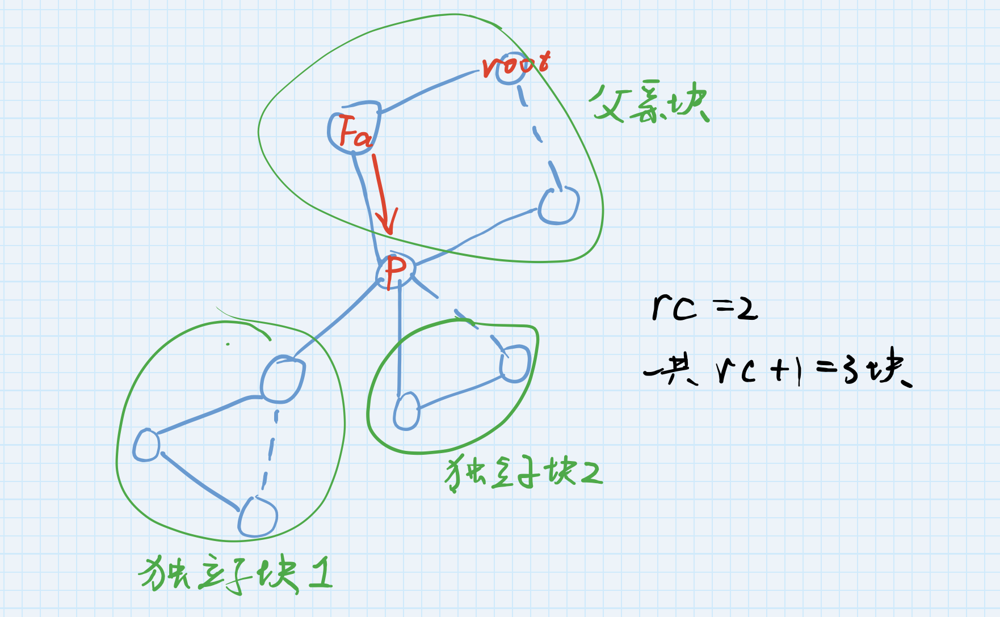
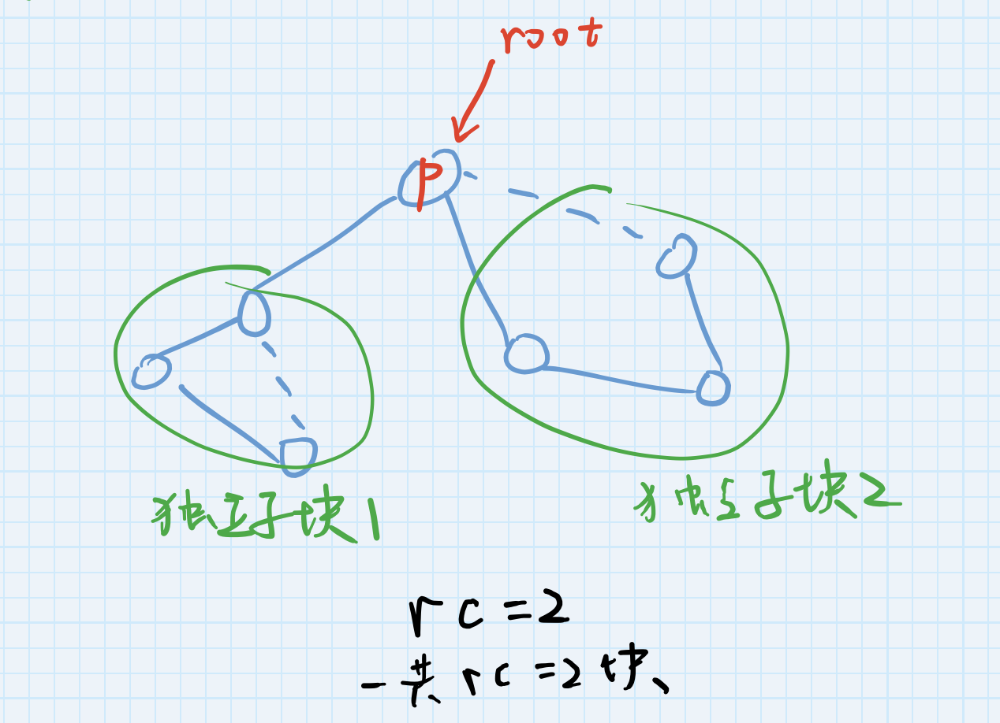
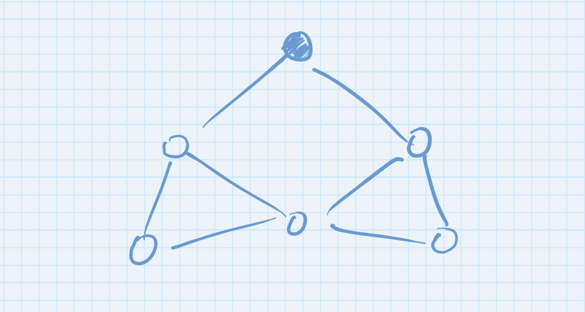
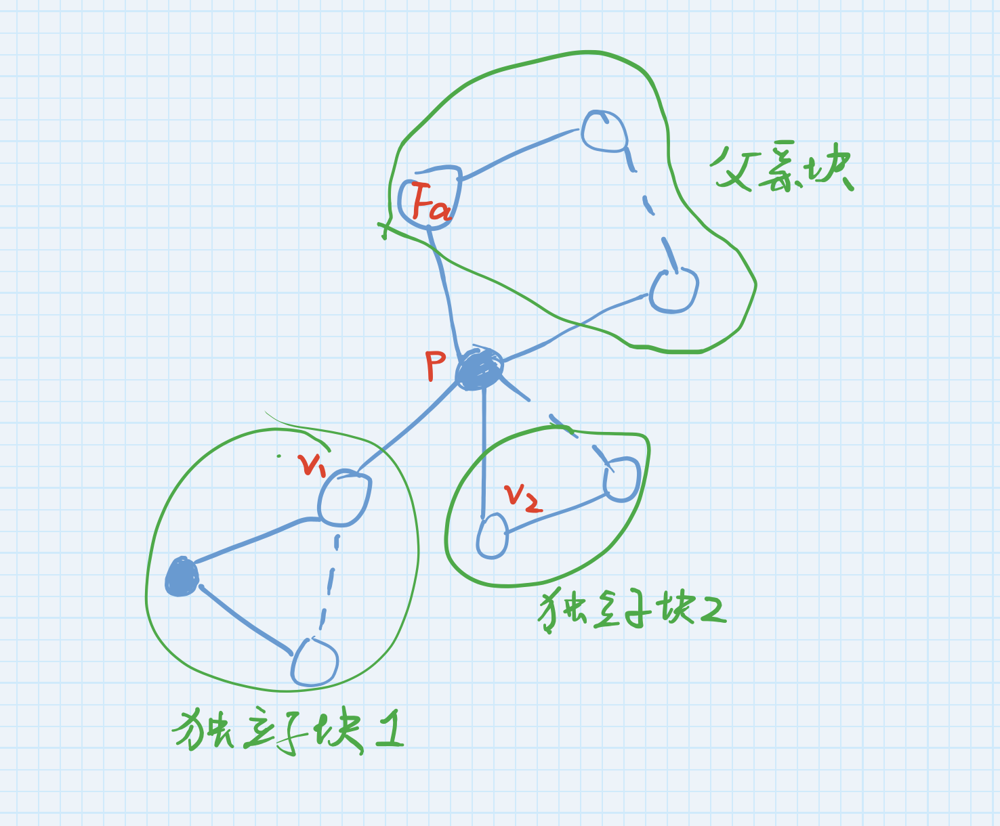

# 保护御坂网络
<h3 align="right">--「○○、とミサカは言ったようにします。」</h3>

<div align="center">
    
</div>

<p align="center" style='font-size:12px;color:gray'>我们的主人公</p>

* **题面解析**
    > 给定一张[n][1]个点的无向图，其中给出[m][2]个点被感染，选择一个被感染的点将之与之相连点所有边去除，问如何选择，使得最后和感染的点连通的点最少？

[1]:1500
[2]:1500

* **暴力方法**

最简单直接的想法是，如果问删除哪个点使得答案最优，那么不妨枚举删除哪一个点。

于是，现在问题转变成了，已知某一个点被删除了，问被感染的点有多少？暴力的想法是，一个点如果被感染，那么那个点必定和某个被感染的点相连。所以，我们可以从每个点都开始深搜一遍，搜到感染点就退出。但是这样太慢了，复杂度大约为O(mn^2)。继而考虑到，只有被感染的点才能感染其他点，所以不妨从每一个被感染点开始遍历，每次碰到一个新的节点就加一个新的点，最终统计一下被感染点的个数，这样的复杂度是O(m*n)的，这也是这题的标准解法。此处不贴代码。

* **改进思路？**

    1 . **无向图的割点**

    * **定义**
        
        啥叫割点？

        

        很形象，此图中点4与5就是割点。严格地来说，一个点为割点，当且仅当将这个点删除以后，图分成了两个及以上的联通块。

        一开始看到这道题，第一反应是应该去掉的点是这张图上的割点（其实并不一定），因为这样就可能割掉病毒传播到另外一个联通块的路径。

    * **怎么求割点?**
        
        我们回忆一下上课老师讲的DFS生成树，假设这张图我们从一号点走起，并且从编号较小的点开始访问，那么搜索树长成这样：
		
        
        
        其中，蓝色的实线表示树边，是真正在遍历中走过的边，虚线称之为**返祖边**，表示尝试走这条边过，但是发现这条边连向的点之前访问过了，是它的祖先。

        同时，我们用绿色的数字为我们标一下我们访问这个点的次序，即这个点是第几个访问到的点。下面称这个绿色序号为**时间戳**，可以用它来表示访问某个点的早晚。

        

        我们再来考虑一件事情：以四号点为例，我们从2访问到4，然后从4访问5与3，容易看出，走4->5这条路过，不肯能访问到比4更早的点，但是走4->3这条路，可以访问到比4更早的一号点。因此可以看出，割去点4，会导致5所在的块孤立出去，但是3所在的块应该和4的祖先有所联系。

        那么我们不妨考虑这样一个数量：每一个点能在搜索树中追溯到的最早的点的时间戳 low[i]。
        
        这个说法可能有点绕，以下举例介绍。这个量用黑色写出：

        

        8号点在遍历中通过一条返祖边碰到了时间戳为5的5号点，low[8]=5；

        7号点在遍历中通过7->8->5这条路径碰到过时间戳为5的5号点，所以这个量也为low[7]=5；

        4号点在遍历中最早能碰到的时间戳是通过4->3->1碰到的1号点的时间戳1，所以low[4]=1。

        我们假设时间戳存在数组dfn里面，下面贴出代码来处理low和dfn：

        ```c++
        void tarjan(int p){
            dfn[p]=++timeStamp;        //第一次访问这个点，那么+1s，记一下当前的时间作为时间戳
            low[p]=dfn[p];     //显然 p号点肯定可以碰到自己，所以low小于等于dfn
            for(edge *i=head[p];i!=NULL;i=i->next){
                if(dfn[i->to]!=0){//访问到一个dfn不为0的点，那么应该是一条返祖边
                    if(dfn[i->to]<low[p]) low[p]=dfn[i->to];
                    //碰到了自己的祖先，看一下这个祖先是不是比自己已经碰过的点都要早，是的话就更新low
                }
                else{
                    tarjan(i->to);//先求一下这个点最早能碰到多早的时间戳
                    if(low[i->to]<low[p]) low[p]=low[i->to];
                    //看一下这个点能访问到最早的时间戳是谁，因为p到i->to有一条边，所以p也可以访问到这个时间戳。更新low
                }
            }
        }
        ```

        上述代码有点难以理解（事实上笔者自己当时也纠结了好久，结果果断选择先背代码，打多了、分析多了就懂是什么意思了）

        举个例子，上图的7号点，一开始low[7]=dfn[7]=7,表示7能碰到的最早的时间戳至少是它自己。

        7有两条边，一条是返祖边7->6,既然是返祖边，那么就是往回碰一下，能碰到时间戳6（比现在low[7]=6要小），所以low[7]=dfn[6]=6;

        第二条边是7->8,是一条正常的树边。先递归求出low[8]=5,由于7连着8，8能碰到时间戳5，所以7也能碰到时间戳5（比现在low[7]=6要小），所以low[7]=low[8]=5。
        
        以此递归地求出low和dfn，读者可以手动模拟一下加深理解。

        然后呢，我们考虑一下真正走过的边4->5。low[5]=3 >= dfn[4],什么意思呢？5在搜索中能碰到的最早的点不早于4。那么去掉4以后，5的这一块都不可能碰到比4更早的1、2（4的父亲）、3三个点，说明5所在的这一块是独立于4的父亲2所在的这一块的。

        注意，以上所有的dfn和low都是对于同一棵搜索树说的，并不是同一张图。所以同一张图可能有不同的遍历搜索顺序，dfn和low也不尽相同，但是对于同一个遍历顺序来说应该是一样的。

        假如p->v有一条树边，先递归进入算一下low[v]，回溯的时候判断如果low[v]>=dfn[p],说明v所在的这一块是割去p以后的独立子搜索树。统计一下独立子搜索树的数目rc。
        
        分两种情况：
        假如p是一般的点，它从p的祖先走入，且算出来rc>=1,割去p以后至少有p祖先一块和rc个独立子树，合起来总共rc+1>=2,则p是割点；
        
        <p align='center' style='font-size:12px;color:gray'>p不是根</p>
        假如p是搜索树的根，且rc>=2,那么p没有父亲块，则割去p以后剩下rc>=2个独立子块,p也是割点。

        
        <p align='center' style='font-size:12px;color:gray'>p是根</p>

        以下附上代码

        ```c++
        void tarjan(int p,int r){
            dfn[p]=++ind;
    		low[p]=ind;
    		int rc=0,v;
    		for(int i=last[p];i;i=yest[i]){
        		v=point[i];
        		if(!dfn[v]){
            		tarjan(v,r);
            		if(low[v]<low[p]) low[p]=low[v];
            		if(low[v]>=dfn[p]) rc++;
        		}
        		else
            		if(dfn[v]<low[p]) low[p]=dfn[v];
    		}
    		if(p==r&&rc>=2) cut[p]=1;
    		if(p!=r&&rc>=1) cut[p]=1;
		}
        ```

		这个求割点的算法叫做Tarjan算法，是美国计算机科学家***Robert Tarjan***（罗伯特·塔扬）提出的。Tarjan是能和Dijkstra、Knuth等齐名的算法艺术家。因为他提出的算法大多数都用他的名字来命名，所以很多算法都叫Tarjan算法，包括求有向图强连通分量、并查集离线求两个树上两个节点的最近公共祖先等算法。**他还提出了运用广泛的伸展平衡树Splay、动态树LinkCutTree，证明了并查集的复杂度**。

		<div align="center">
        
		</div>

        <p align="center" style='font-size:12px;color:gray'>罗伯特·塔扬</p>
	2 . 割点和御坂妹妹的联系

	* **是否必然呢？**
		
		事实上，我们要割掉的点，并不一定是割点才有效。我们考虑以下一种情况：

		
		<p align="center" style='font-size:12px;color:gray'>蓝色为感染点  白色为健康点</p>

		可以看出，割掉上图蓝点后，原先被感染的所有点都不会被感染了，但是蓝色的点不是一个割点。

		因此，本题真正的关键点不在割点。上述情况可以通过分类讨论去特判，但是特判条件太复杂，代码不可打。但是割点算法确可以改编运用。
	
	* **正确解法**

		一般来说割去感染点p后，如果p不是孤立的，必定剩下来n块，其中n>=1，如果p不是根，则有一块是父亲块。
		我们考虑剩下来的每一块：

		

		显然，这张图上的每一个点都能被p感染。

		* 对于独立子块1:

			这块里面有三个点，而且本身有一个点被感染了。割掉p以后，这三个点都会被这一块里面的原来那个蓝点感染。所以割不割p对独立子块1无效。
		
		* 对于独立子块2:

			这块里面只有两个点，而且本身没有蓝点。本来都会被p感染，割掉p以后，这两个点相当于被p救了。

		从而归纳出以下结论：
		
		设割掉p以后的独立子块含有k个点，fk个感染点，那么：

		* 如果fk=0，k个点在割掉p以后免于受感染，被k拯救

		* 如果fk>0，k个点在割掉p以后仍然要被块内的蓝点感染，割不割p与之无关。

		因此我们得出解法：用Tarjan的算法主流程，在p点，计算出一个独立子块后，同时计算出独立子块的点数k和其内部的感染点fk，如果fk=0，那么save[p]+=k;否则不计算。之后统计一下每一个点的save值，最大的点就是我们的答案。

		这里派生出两个问题：
		
		* 怎么计算独立子块的k与fk？

			DFS有一个很好的性质。我们在DFS之前保存一下当前的时间戳tind=ind，dfs完以后，全局变量ind的值改变了。可以看出ind-tind=k。什么意思呢，我们dfs之前，已经一共访问了tind个点，dfs之后，我们一共访问了ind点，既然我们dfs了一棵独立子树，那么前后时间戳ind的差值就是这次dfs带来的增量。

			简单说，进去前时间为a，出来后时间为b，那么这次dfs的耗时就是b-a，这个耗时是每访问了一个新的节点就加1的，所以b-a=k。

			fk同理，不同的是，处理k的时候的时间戳是每访问了一个新的节点就自增的，处理fk的时候只有在访问感染点的时候才自增。

		* 父亲块怎么处理？
			
			这个问题是笔者一开始几次Wrong Answer的原因。父亲块的k和fk是不能简单从正面求出的。正难则反，采用补集思想，我们做完这一块一整块的dfs以后，也能得出这一整块的k和fk。用它减去p点和其所有子块的k和fk以后，剩下来的就是p的父亲块的k和fk。
		
		处理完所有的k和fk以后计算save[p],找到最大的序号最小的就是答案。如果save都为0，输出-1。

		这个算法的总复杂度就是遍历的复杂度o(n+e),e是边数。

	3. **然而**
	
		实际运行情况下，本题最大的优化是这段代码：
		```c++
		for(int i=0;i<n;i++){
    	    fgets(inp,3010,stdin);
    	    pt=inp;
    	    for(int j=0;j<n;j++){
            	if(*pt=='1'&&i!=j) adde(i,j);
            	pt+=2;
        	}
   		}
		```

		直接提速16倍以上。。。

		~~至今为止我们所做的努力全部木大~~

		~~希望之花~~
	
	4. **题外话**
		
		上述的Tarjan算法在计科开的数据结构是讲的，所以其实不算太超纲的内容。并且助教并不卡这题复杂度，这是坠吼的。大家都是摸爬滚打起来的，不过是闻道有先后，术业有专攻。助教开OJ也是为了增加大家体验，手动检查就是WARETLE+检查机会少+去机房麻烦+看助教脸色，OJ至少把后三点去掉了，用惯了自然舒服。都是为了学点东西，有点深的知识，全看得懂最好，看不懂也大概留个感性认识，以后提起来有个印象。因为各种原因而随便暴躁起来终究于己无益，于他人也坏了和气。